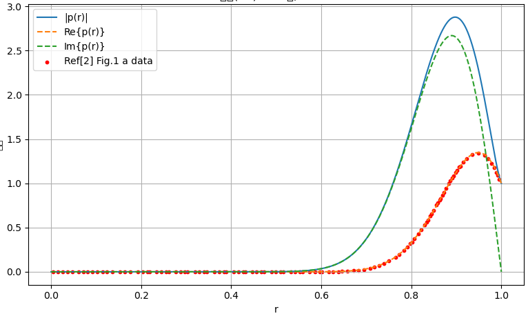
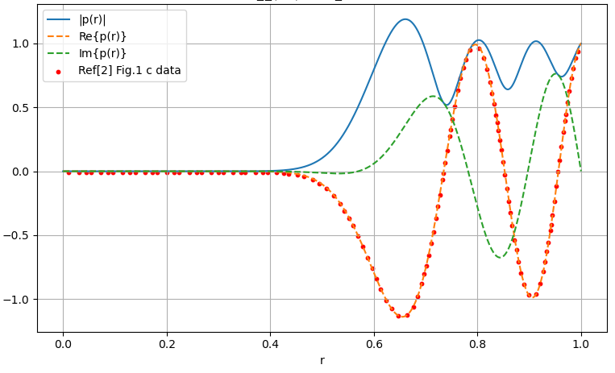

### **引言与理论背景**

#### **引言**
现代涡扇发动机广泛使用声学衬里来降低进气道和旁通管道中的噪声。声学衬里的优化设计对于减少航空发动机的噪声至关重要。为了实现这一目标，通常会使用简单的数学模型和复杂的数值模拟来优化声学衬里的类型和位置，以获得最大的降噪效果。声学与声学衬里的相互作用通常通过衬里的阻抗来描述。当声学叠加在滑过衬里的平均流动上时，Myers边界条件被广泛用于描述这种相互作用。然而，Myers边界条件在处理滑动流动时会导致数值不稳定性和数学上的不适定性问题。为了克服这些问题，[参考1](https://www.researchgate.net/profile/Danilo-Braga-2/publication/325439062_On_the_prediction_of_far-field_fan_noise_attenuation_due_to_liners_considering_uniform_and_shear_flows/links/5b380eef4585150d23e988ee/On-the-prediction-of-far-field-fan-noise-attenuation-due-to-liners-considering-uniform-and-shear-flows.pdf)提出了一种改进的边界条件，通过考虑边界层的有限厚度来使其更加适定。

这篇博客主要介绍参考1文献中的Pridmore-Brown公式(12)(13)的计算实现以及验证。
#### **理论背景**

##### **A. 控制方程**
本文的控制方程是不可压缩、理想气体的运动方程，具体如下：

$$
\frac{\partial \rho}{\partial t} + \nabla \cdot (\rho \mathbf{u}) = 0, \quad \rho \frac{D \mathbf{u}}{Dt} = -\nabla p, \quad \frac{Dp}{Dt} = \frac{\gamma p}{\rho} \frac{D\rho}{Dt}
$$

其中，$ \rho $ 是密度，$ \mathbf{u} $ 是速度，$ p $ 是压力，$ \gamma $ 是比热比。假设流动是轴对称的，使用圆柱坐标系 $ (x, r, \theta) $，其中 $ x $ 轴沿圆柱中心线。流动的轴向速度 $ U(r) $ 和密度 $ R(r) $ 是 $ r $ 的任意函数。

假设声学扰动量 $ \tilde{p} $、$ \tilde{\mathbf{u}} $ 和 $ \tilde{\rho} $ 相对于平均流动很小，通过线性化处理，可以得到以下方程：
$$
\begin{aligned}
i(\omega - U k) \tilde{\rho} &= -\frac{dR}{dr} \tilde{v} - \frac{R}{r} \frac{d(r \tilde{v})}{dr} + \frac{i m R \tilde{w}}{r} + i k R \tilde{u}, \\
i R (\omega - U k) \tilde{v} &= -\frac{d\tilde{p}}{dr}, \\
i R (\omega - U k) \tilde{w} &= \frac{i m}{r} \tilde{p}, \\
i R (\omega - U k) \tilde{u} &= i k \tilde{p} - R \frac{dU}{dr} \tilde{v}.
\end{aligned}
$$
通过消去所有声学变量，最终得到圆柱坐标系下的Pridmore-Brown方程：
$$
\frac{d^2 \hat{p}}{dr^2} + \left( \frac{1}{r} + \frac{2 k_{m,n}}{k - M k_{m,n}} \frac{dM}{dr} \right) \frac{d \hat{p}}{dr} + \left( (k - M k_{m,n})^2 - k_{m,n}^2 - \frac{m^2}{r^2} \right) \hat{p} = 0, \tag{12}
$$

当$dM/dr=0$时，可以得到如下均匀流方程
$$
\frac{d^2 \hat{p}}{dr^2} + \frac{1}{r} \frac{d \hat{p}}{dr} + \left( (k - M k_{m,n})^2 - k_{m,n}^2 - \frac{m^2}{r^2} \right) \hat{p} = 0,
 \tag {13}$$
其中 $ \hat{p} $ 是声压的扰动量，$ k_{m,n} $ 是径向波数，$ m $ 是方位波数。

##### **B. 边界条件**
在 $ r = 0 $ 处，要求声压 $ \tilde{p} $ 是正则的。在 $ r = 1 $ 处，应用阻抗边界条件 $ \tilde{p}/\tilde{v} = Z $，得到：
$$
i \omega Z \tilde{p}' - \omega^2 \tilde{R}(1) \tilde{p} = 0.
$$
Myers边界条件假设平均流动在边界层外是均匀的，得到：
$$
i \omega Z \tilde{p}' - (\omega - M k)^2 \tilde{p} = 0.
$$
然而，Myers边界条件在处理滑动流动时会导致数值不稳定性和不适定性。因此，本文提出了一种改进的边界条件，通过考虑边界层的有限厚度来解决这些问题。

为了进一步解释改进的边界条件，我们引入了边界层的修正项。具体来说，边界层的修正项可以通过以下公式表示：
$$
\delta I_0 = \int_{0}^{1} \left(1 - \frac{(\omega - U(r)k)^2 R(r)}{(\omega - M k)^2}\right) dr \tag{23}
$$
$$
\delta I_1 = \int_{0}^{1} \left(1 - \frac{(\omega - M k)^2}{(\omega - U(r)k)^2 R(r)}\right) dr \tag{23}
$$
这些积分项考虑了边界层的有限厚度，并且在边界条件中引入了修正项。最终的改进边界条件可以表示为：
$$
Z \left[ \tilde{v}_o + \frac{k^2 + m^2}{i (\omega - M k)} \delta I_1 \tilde{p}_o \right] = \frac{\omega - M k}{\omega - U(1)k} \left[ \tilde{p}_o + i (\omega - M k) \delta I_0 \tilde{v}_o \right]
$$
其中，$ \tilde{v}_o $ 和 $ \tilde{p}_o $ 分别是忽略边界层时的壁面速度和压力。

此外，边界层的修正项还可以通过边界层的物理参数进行解释。例如，边界层的质量厚度、动量厚度和动能厚度分别为：
$$
\delta_{\text{mass}} = \int_{0}^{1} (1 - R(r)) dr, \quad \delta_{\text{mom}} = \int_{0}^{1} \left(1 - \frac{R(r) U(r)}{M}\right) dr, \quad \delta_{\text{ke}} = \int_{0}^{1} \left(1 - \frac{R(r) U(r)^2}{M^2}\right) dr
$$
这些厚度参数可以用于进一步解释边界层对声学特性的影响。

### 代码实现
可以看出，求解公式(12)/(13)是一个ODE的边值问题，我选择使用了python的scipy来求解。对比的case选择参考2的Figure1的的case，即参数如下：

1. 马赫数 $M=0.5$
2. 波数 $\omega=31$
3. 周向模态 $m=24$
4. 轴向波数 $ k_{m,n}=-44.2+1.1i 或者\\  k_{m,n}=-17.6-21.0i $
5. 声阻抗 $Z=2+0.6i$

代码如下：
```python
import numpy as np
from scipy.integrate import solve_bvp
from scipy.special import jv, jvp
import matplotlib.pyplot as plt

"""
Ref:[1] On the prediction of far-field fan noise attenuation due to liners considering uniform and shear flows
Ref:[2] A well-posed boundary condition for acoustic liners in straight ducts with flow
1. 主要参考了Ref[1]
2. 根据Ref[2]做了修改
3. 结果与Ref[2]做对比
"""

# ------------------------------------------------------------------------------------
# 参数设置（可自行修改）
# ------------------------------------------------------------------------------------
m = 24  # 模态阶数
k = 31.0  # 无量纲波数
M = 0.5  # 马赫数

case = "a"  # ref[2]中figure1的case是a还是c
if case == "a":
    kmn = -44.2 + 1.1j  # Ref[2] a,b 轴向波数（可取复数）
else:
    kmn = -17.6 - 21.0j  # Ref[2] c,d 轴向波数（可取复数）


Z = 2.0 + 0.6j  # 壁面阻抗（复数）
omega = k  # 角频率，若使用不同无量纲化请自行修改
r_min = 1e-13  # 避免 r=0 的奇点，从一个很小的半径开始
r_max = 1.0
delta = 0.0002
isShearFlow = True  #
# ------------------------------------------------------------------------------------
# 将复数问题拆为实数 4 维系统
# y = [Re(p), Im(p), Re(dp/dr), Im(dp/dr)]
# ------------------------------------------------------------------------------------


# Ref[2] 公式(14)的对r的导数
def du0dr(r, delta):
    a = 1.0 - np.tanh(1.0 / delta)
    b = (1 + np.tanh(1.0 / delta)) / delta
    return M * (
        (1.0 - np.tanh((1.0 - r) / delta) ** 2) * (-1.0 / delta)
        + a * (-2.0 * (b + 1.0) * r + b)
    )


# Ref[1] 公式有误，使用Ref[2]的公式，应当*r，而不是+r
def u0(r, delta):
    return M * (
        np.tanh((1 - r) / delta)
        + (1 - r)
        * (1 - np.tanh(1 / delta))
        * ((1 + np.tanh(1 / delta)) / delta * r + (1 + r))
    )


def ode(r, y):
    p = y[0] + 1j * y[1]
    dp = y[2] + 1j * y[3]
    U = u0(r, delta) if isShearFlow else M
    coeff = (k - U * kmn) ** 2 - kmn**2

    if isShearFlow:
        denom = k - U * kmn
        dMdr = du0dr(r, delta)
        # 这里1e-12的作用？
        dMdrPart = np.where(np.abs(denom) > 1e-12, 2.0 * kmn / denom * dMdr, 0.0)
    else:
        dMdrPart = 0.0

    inv_r = np.where(r > 0.0, 1.0 / r, 0.0)
    inv_r2 = np.where(r > 0.0, m**2 / r**2, 0.0)
    d2p = -(inv_r + dMdrPart) * dp - (coeff - inv_r2) * p

    return np.vstack(
        [
            y[2],
            y[3],
            d2p.real,
            d2p.imag,
        ]
    )


def boundary_conditions(ya, yb):
    # r = r_min: 正则性 => r_min·p'(r_min) - m·p(r_min) = 0
    # 需要乘以r_min嘛？
    bc_center_real = r_min * ya[2] - m * ya[0]
    bc_center_imag = r_min * ya[3] - m * ya[1]

    # r = r_max: Ingard-Myers 边界条件
    p_wall = yb[0] + 1j * yb[1]
    dp_wall = yb[2] + 1j * yb[3]
    u_wall = u0(r_max, delta) if isShearFlow else M

    # 这个结合Ref[1] 公式(10),(19)组合与Ref[2]的公式(5)一致，都能得到如下边界条件
    impedance_condition = dp_wall - (k - u_wall * kmn) ** 2 / (1j * k * Z) * p_wall

    return np.array(
        [
            bc_center_real,
            bc_center_imag,
            impedance_condition.real,
            impedance_condition.imag,
        ]
    )


# ------------------------------------------------------------------------------------
# 初始猜测：使用 Bessel J_m(alpha r)，其中 alpha^2 = (k - M kmn)^2 - kmn^2
# ------------------------------------------------------------------------------------
alpha_squared = (k - M * kmn) ** 2 - kmn**2
alpha = np.sqrt(alpha_squared)

max_nodes = 1200000
r = np.linspace(r_min, r_max, max_nodes // 2)  # 这里点数太少导致幅值不对

p_guess = jv(m, alpha * r)
dp_guess = alpha * jvp(m, alpha * r)

y_guess = np.vstack(
    [
        p_guess.real,
        p_guess.imag,
        dp_guess.real,
        dp_guess.imag,
    ]
)


# ------------------------------------------------------------------------------------
# 调用 solve_bvp
# ------------------------------------------------------------------------------------
sol = solve_bvp(ode, boundary_conditions, r, y_guess, max_nodes=max_nodes)

if not sol.success:
    raise RuntimeError(f"solve_bvp 未收敛: {sol.message}")


# ------------------------------------------------------------------------------------
# 后处理与绘图
# ------------------------------------------------------------------------------------

# 这个根据Ref[2]要求归一化
p_wall = sol.y[0][-1] + 1j * sol.y[1][-1]
scale = 1.0 / p_wall
p_r = (sol.y[0] + 1j * sol.y[1]) * scale
dp_r = (sol.y[2] + 1j * sol.y[3]) * scale

print("p_wall (normalized to 1):", p_wall)

print("求解成功，最大残差 =", np.max(np.abs(sol.rms_residuals)))
# 读取文献数据
# 打开并读取文件(把Ref[2] figure 1的数据读入，作为golden data)
if case == "a":
    file_path = "./ref2_f1a.txt"  # Ref[2] a,b 数据文件路径
else:
    file_path = "./ref2_f1c.txt"  # Ref[2] c,d 数据文件路径
x_values = []  # 存储第一列数据
y_values = []  # 存储第二列数据

with open(file_path, "r") as file:
    for line in file:
        # 去掉行首行尾的空白字符，并按逗号分割
        x, y = line.strip().split(",")
        # 将字符串转换为浮点数，并添加到列表中
        x_values.append(float(x))
        y_values.append(float(y))
# 转换为numpy数组
x_values = np.array(x_values)
y_values = np.array(y_values)
print("x_values:", x_values)
print("y_values:", y_values)

plt.figure(figsize=(8, 5))
plt.plot(sol.x, np.abs(p_r), label="|p(r)|")
plt.plot(sol.x, p_r.real, "--", label="Re{p(r)}")
plt.plot(sol.x, p_r.imag, "--", label="Im{p(r)}")
plt.scatter(x_values, y_values, color="red", s=10, label="Ref[2] Fig.1 c data")
# p_r的幅值，相位模式
plt.xlabel("r")
plt.ylabel("声压")
plt.title(f"公式(13) BVP 解,m={m}")
plt.legend()
plt.grid(True)
plt.tight_layout()
plt.show()
```

#### 结果
这里截取了参考2的Figure1的数据结果与代码的结果对比，其中红色点为参考2的结果，实线为代码结果





### 总结

1. 使用python的scipy实线求解Pridmore-Brown方程
1. 为以后与有限元代码计算Ingard-Myers边界条件提供理论解释
### 参考
1. Braga D S, Spillere A, Cordioli J A, et al. On the prediction of far-field fan noise attenuation due to liners considering uniform and shear flows[C]//2018 AIAA/CEAS Aeroacoustics Conference. 2018: 3283.
2. Brambley E J. Well-posed boundary condition for acoustic liners in straight ducts with flow[J]. AIAA journal, 2011, 49(6): 1272-1282.